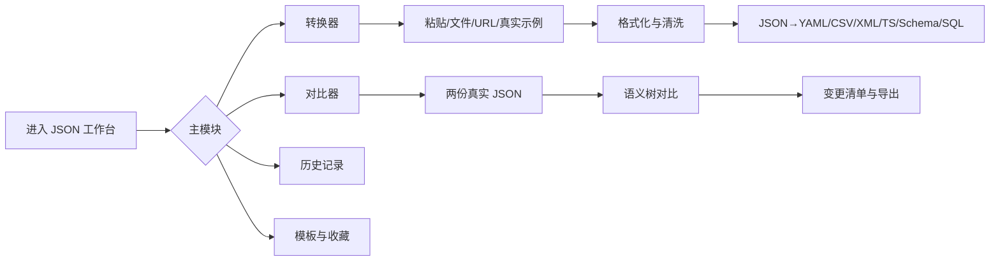

# FunBox JSON 工作台 产品设计方案 V1

> 版本：一期全量版（V1）  
> 日期：2026-08-02  
> 状态：待评审  
> 定位：FunBox 内置的开发者工具，一站完成 JSON 格式化、格式转换与结构化对比，全部在本地处理真实数据。

## 1. 产品概述

### 1.1 一句话定位

一个“打开即用、数据不出浏览器”的 JSON 工作台：粘贴真实 JSON 即可格式化、清洗、转换格式、生成类型/Schema，并把任意两份真实 JSON 做语义级对比。

### 1.2 背景与问题

日常开发、联调、数据分析中，JSON 是最常见的数据载体，但现有工具分散：

- 格式化工具只解决“美化/压缩”，不解决字段重命名、扁平化、数组转 CSV 等结构化需求。
- 在线转换工具需要把公司内部、生产环境或含敏感字段的数据上传到第三方服务器，存在数据泄露风险。
- JSON 对比工具大多停留在“文本行 diff”：键顺序变化、数字精度差异、数组重排都会造成大量伪差异，无法快速定位真实变更。
- 同一段 JSON 往往要在多个站点之间来回搬运，没有历史、模板和批量能力。

### 1.3 与 FunBox 现有能力的衔接

- 功能注册表已预留工具位，新增 `json-workbench` 工具入口，名称“JSON 工作台”，分类“开发”，路由 `/tools/json-workbench`。
- 前端沿用 Expo/React Native 工具页、主题系统、图标体系与“最近使用”能力；Web 端使用独立响应式页面承载桌面完整能力。
- 后端仅用于账号登录、历史记录同步与收藏；解析、转换、对比全部在客户端本地完成，不把用户数据送到服务端。

### 1.4 产品目标

1. 用户从进入工具到完成一次格式化/转换不超过 20 秒。
2. 核心处理链路 100% 本地执行，任何输入数据默认不上传。
3. 语义对比能识别“键顺序变化”和“数组重排”并默认折叠为无变化，减少伪差异。
4. 内置示例、验收用例、设计稿全部使用真实数据并标注来源，禁止假数据与 mock 数据。

### 1.5 明确排除项（不属于本期产品边界）

- 不做可视化 JSON 图谱与画布式编辑；本期采用代码 + 树形对比视图，不做节点拖拽画布。
- 不做团队协作与多人共享；历史与模板同步仅限本人账号。
- 不做通用代码生成器；只做 JSON Schema、TS 类型、SQL INSERT 三类模板。
- 不做公式化多步骤流水线编辑器；本期保持单任务界面，但转换规则模板可一键复用。

## 2. 目标用户与场景

### 2.1 目标用户

- 前后端开发者：联调接口、排查线上返回、生成类型定义。
- 数据分析师：把接口 JSON 转 CSV 后进表格，或对比两版数据差异。
- 运维与测试：核对配置变更、导出配置文件、对比新旧环境返回。
- FunBox 高频工具用户：希望在手机上也快速完成小段 JSON 的格式化和转换。

### 2.2 核心场景

| 场景 | 用户行为 | 产品应满足 |
| --- | --- | --- |
| 联调排错 | 从接口复制返回 JSON，想看清结构 | 粘贴即美化，语法高亮，非法 JSON 定位到行/列 |
| 跨格式交付 | 把配置 JSON 转 YAML 给同事，或转 CSV 进表格 | 一键 JSON→YAML/CSV/XML，数组对象自动展开 |
| 接口对接 | 看接口返回缺了哪些字段 | 与文档/旧版 JSON 对比，按路径列出新增、删除、修改 |
| 升级核对 | 依赖升级后核对 package.json 差异 | 忽略键顺序与空值，只看真实变更 |
| 数据清洗 | 字段名不统一、有 null、重复项 | 键重命名、空值忽略、数组去重、排序 |
| 生成类型 | 想让后端返回变成 TS 类型/Schema | 一键生成 TypeScript interface 与 JSON Schema |

## 3. 竞品与差异化

| 产品 | 强项 | 主要缺口 | FunBox 差异化 |
| --- | --- | --- | --- |
| JSON.cn / bejson | 格式化、转义、简易对比 | 需上传数据，对比为文本级，广告多 | 本地处理、语义对比、真实示例 |
| JSON Crack | 可视化树图 | 偏查看，转换与批量清洗弱 | 转换、对比、模板一体化 |
| jq / yq CLI | 强大、可脚本化 | 有学习成本，非图形化 | 图形化 + JSONPath 表达式辅助 |
| GitHub Compare | 面向代码/配置 | 非 JSON 语义，需在仓库内 | 任意粘贴两份 JSON 即可对比 |
| 在线 diff 工具 | 简单直接 | 键顺序导致伪差异 | 语义树对比，忽略选项丰富 |

差异化结论：V1 不做大而全的编辑器，只做“本地、真实、语义化”三件事，把格式转换和语义对比做成两个主页面，并用真实数据贯穿示例与验收。

## 4. 产品结构与信息架构

JSON 工作台采用桌面 Web 双主模块 + 移动端单页结构：

1. 转换器：输入 → 解析校验 → 格式化/清洗 → 格式转换/结构变换 → 输出导出。
2. 对比器：A/B 输入 → 对比配置 → 语义差异 → 变更清单 → 导出/合并。
3. 历史记录：最近转换/对比会话，可一键回放。
4. 模板与收藏：常用转换规则、对比配置、真实示例。



## 5. 功能设计

### 5.1 输入与解析

输入方式支持四种，互不冲突：

- 粘贴文本：支持 Ctrl+V 直接粘贴，自动检测 JSON 片段。
- 文件：选择 `.json`、`.jsonc`、`.jsonl`，V1 上限 10 MB，超过提示分批/截断。
- URL 拉取：输入公网 HTTPS JSON 地址，客户端发起请求；跨域失败时给出“请粘贴内容”的降级提示，禁止把 URL 数据转发到服务端。
- 真实示例：内置数据全部来自真实公开源（GitHub 仓库文件、Open-Meteo 天气、npm registry），每个示例标注来源 URL 与抓取时间。

解析规则：

- 自动识别 JSON / JSONC（去注释）/ JSON Lines（按行解析为数组）。
- 非法 JSON 提示错误位置：行号、列号、出错片段与原因（缺逗号、引号未闭合、尾逗号、BOM 等）。
- 解析结果展示摘要：节点数、对象数、数组数、最大深度、字节数、估算耗时。

### 5.2 格式化与清洗

| 能力 | 规则 |
| --- | --- |
| 美化/压缩 | 缩进 2/4/Tab 可配，JSON 语法高亮，数字与键名高亮区分 |
| 键排序 | 字母序 / 保持原序 / 按自定义键序 |
| 去重 | 数组按完整值去重，对象数组按指定键去重 |
| 空值策略 | 忽略 null / 保留 null / null 转空字符串，可作用于全局或指定路径 |
| 键名规范 | 驼峰、下划线、短横线互转，支持正则映射 |
| 转义处理 | 反转义/转义 Unicode、HTML 实体、控制字符 |
| 行尾与编码 | 自动检测 BOM、CRLF/LF，输出可选 UTF-8 |

所有清洗动作可撤销（本地内存快照），批量动作显示影响路径数量。

### 5.3 格式转换

支持方向：

- JSON → YAML：保留对象/数组/布尔/数字类型，多行字符串按 YAML 块语法。
- JSON → CSV：仅数组对象或对象数组可转，自动取并集字段作为表头，支持分隔符、表头大小写。
- JSON → XML：嵌套对象转元素，数组用重复元素，属性与文本节点可配置。
- JSON → JSON Lines：对象数组逐行输出。
- JSON → TypeScript：生成 interface/type，自动推断可选字段与数组类型。
- JSON → JSON Schema：基于真实值推导类型、必填、枚举与格式。
- JSON → SQL INSERT：对象数组生成 INSERT 语句模板，字段名自动安全转义。
- YAML / CSV / XML / TOML → JSON：反向解析，本期全部支持。

转换配置以“规则模板”保存：例如“后端驼峰转下划线 + 忽略 null + 输出 CSV”，下次一键复用。

### 5.4 结构变换

- 扁平化/展开：嵌套对象拍平为 `a.b.c` 键，或按分隔符展开。
- 数组展开：对象数组转多行，行内保留父级键。
- 键映射：界面化“原键 → 新键”映射，支持路径写法 `data.items[0].name`。
- 过滤：按路径或 JSONPath 表达式选择/排除字段。
- 字段计算：把时间戳转日期、数字格式化等常用转换器，V1 提供 6 个内置函数。
- 模板映射：通过 JSON 模板定义目标结构，用 `{{ $.path }}` 语法把源字段映射到目标字段。

### 5.5 JSON 对比

对比器是 V1 的核心差异化能力，包含三种模式：

1. 语义树对比（默认）：按 JSON 结构递归对比。键顺序变化、数组元素重排（可配置）、纯空值差异默认视为无变化。
2. 文本行对比：保留原始行号，适合查看格式本身变化。
3. 单路径对比：输入同一路径，对比两个值并给出类型变化提示。

对比配置项：

| 配置 | 默认 | 说明 |
| --- | --- | --- |
| 忽略键顺序 | 开 | 对象键重排不产生差异 |
| 忽略空值 | 开 | null / 缺失 / 空串按等价处理 |
| 数组策略 | 按索引 | 按索引 / 按唯一键（如 `id`）/ 按重排检测 |
| 数字精度 | 精确 | 精确 / 保留 2 位 / 忽略尾零 |
| 大小写敏感 | 开 | 字符串大小写是否算差异 |

差异结果：

- 顶部统计：修改 / 新增 / 删除 / 无变化四类节点数。
- 树形差异视图：红绿着色，展开/折叠差异节点，点击跳到原文行。
- 变更清单：按路径排序，每行显示“路径、变更类型、A 值、B 值”。
- 导出：差异摘要 Markdown / 变更清单 CSV / 合并后的 JSON（可选择采用 A、采用 B、逐条选择）。

### 5.6 历史、模板与收藏

- 每次转换/对比自动生成一条历史记录：输入摘要、输出格式、配置、耗时、结果统计。
- 历史记录支持回放（重新载入输入与配置）、重命名、删除；登录用户可同步到服务端。
- 模板分两类：转换规则模板、对比配置模板；示例模板固定为“真实数据示例”。
- 收藏上限 50 条，历史保留最近 200 条（本地 IndexedDB）。

### 5.7 大文件与性能

- 解析、清洗、转换、对比全部在 Web Worker 中执行，主线程不卡顿。
- 10 MB 上限内分块处理；超过 2 MB 时默认折叠长数组与长字符串，展开时按需渲染。
- 语义对比采用增量差分：先比较指纹，再对差异路径递归，避免整树序列化。
- 渲染使用虚拟列表，展开节点超过 2,000 个时提示“按路径搜索定位”。

### 5.8 隐私与安全

- 默认零上传：URL 拉取仅发生在客户端浏览器，且 CORS 之外不可用。
- 历史记录默认仅本地；账号同步为显式开关，同步内容脱敏（字段名保留、值按配置打码）。
- 对明显含密钥的键（`token`、`secret`、`password`、`key`）提供“敏感字段遮蔽”开关，遮蔽后不进入历史与剪贴板。
- 所有导入文件不写磁盘，仅在内存与 IndexedDB 历史中存在。

### 5.9 移动端适配

- 移动端进入 FunBox 工具列表“JSON 工作台”，默认单栏：
  - 输入区与输出区上下堆叠，Tab 切换“输入/输出”。
  - 对比页 A/B 并排改为左右抽屉或上下切换。
- 支持系统分享面板：从其他 App 收到 JSON 文本可直接打开处理。
- 手机上可用的快捷键弱化，改为固定操作按钮。

## 6. 页面流程

```text
进入 JSON 工作台
  → 转换器（默认）：粘贴/文件/URL/真实示例
    → 解析成功：摘要 + 清洗选项
    → 选择输出格式：YAML/CSV/XML/JSONL/TS/Schema/SQL
    → 转换成功：输出预览 + 复制/下载 + 保存模板
  → 对比器：载入 A / 载入 B（文件、粘贴、历史、真实示例）
    → 配置对比模式与忽略项
    → 查看语义差异树 + 变更清单
    → 导出摘要/合并 JSON / 保存对比会话
  → 历史记录：回放任意会话
```

## 7. 交互与视觉

- 沿用 FunBox 视觉体系：深色 `#151b3b`、主蓝 `#4b6bff`、强调 `#7e5bef`、成功 `#1db991`、警示 `#f1a33b`、危险 `#ff6b8f`；本工具差异色使用绿/红。
- 内容容器最大 1440px，卡片圆角不超过 8px，图标沿用 Lucide / Material Community Icons。
- 桌面双栏工作区：左侧输入/源数据，右侧输出/差异，中间拖拽分隔条可调宽。
- 所有分段选择（输出格式、对比模式）使用分段控件；开关类用 Switch；数值类用 Stepper。
- 支持浅色/深色主题，跟随系统；等宽字体使用 JetBrains Mono 类字体展示 JSON。
- 快捷键：`Ctrl+Enter` 转换/对比、`Ctrl+Shift+F` 美化、`Ctrl+Shift+C` 压缩、`Ctrl+Z` 撤销、`Esc` 关闭面板；移动端隐藏。
- 文本在 320px、390px、430px 视口内不溢出、不重叠；按钮高度不小于 40px。

## 8. 数据模型

### 8.1 本地状态

```text
workspace (IndexedDB)
  recent_sessions
    id, kind(convert|compare), title, input_snapshot, config,
    output_preview, stats, created_at, updated_at
  templates
    id, kind, name, config, source_url, created_at
  favorites
    id, session_id, note, created_at
```

### 8.2 对比会话

```text
compare_session
  id, name, source_a{name, url, fetched_at, content_hash},
  source_b{name, url, fetched_at, content_hash},
  config{ignore_key_order, ignore_empty, array_mode, numeric_precision},
  diff_stats{added, removed, modified, unchanged},
  diff_tree_snapshot
```

### 8.3 时间与内容规则

- 抓取的真实示例保存 `source_url` 与 `fetched_at`，历史回放使用抓取时的快照，不依赖网络。
- 内容哈希使用 SHA-256 用于历史去重与对比加速。
- V1 不做跨时区场景；时间戳转换函数按用户本地时区输出。

## 9. 接口设计

转换与对比本身不经过后端；后端接口仅服务登录、历史与模板：

| 方法 | 路径 | 说明 |
| --- | --- | --- |
| GET | `/api/v1/json-workbench/sessions` | 当前用户历史会话（分页） |
| POST | `/api/v1/json-workbench/sessions` | 保存/同步会话摘要 |
| DELETE | `/api/v1/json-workbench/sessions/{id}` | 删除历史 |
| GET | `/api/v1/json-workbench/templates` | 我的模板 |
| POST | `/api/v1/json-workbench/templates` | 保存模板 |
| PATCH | `/api/v1/json-workbench/templates/{id}` | 更新模板 |

说明：

- 所有接口走现有 JWT 鉴权与限流中间件。
- 新模块位于 `backend/internal/jsonworkbench/`，在 `httpapi/server.go` 注册路由。
- 同步时值字段按“敏感字段遮蔽”配置脱敏后再上传，服务端不保存原始大 JSON，只保存摘要与配置。

## 10. 权限与入口

- 功能注册表新增 `json-workbench`，状态由 `coming-soon` 切换为 `available`，`initialRoles` 保持 `normal / vip / svip / admin`。
- Web 端独立路由 `/tools/json-workbench`；移动端挂入工具列表与首页推荐位。
- 未登录用户可使用本地能力；点击“同步历史/收藏”时引导登录，登录后回到当前页。

## 11. 一期交付范围（全量，不分期）

本期一次交付以下全部功能，不设置分阶段上线：

| 模块 | 一期交付内容 |
| --- | --- |
| 输入与解析 | 粘贴、文件（10 MB）、URL 拉取、真实示例；JSON/JSONC/JSONL 识别与错误定位 |
| 格式化与清洗 | 美化/压缩、键排序、去重、空值策略、键名规范、转义处理、编码检测 |
| 格式转换 | JSON→YAML/CSV/XML/JSON Lines/TS 类型/JSON Schema/SQL；YAML/CSV/XML/TOML→JSON |
| 结构变换 | 扁平化/展开、数组展开、键映射、JSONPath 过滤、字段计算、模板映射 |
| 语义对比 | 语义树/文本/单路径三种模式，忽略配置，差异树、变更清单、合并 JSON 与摘要导出 |
| 历史与模板 | 历史回放、转换/对比模板、收藏、账号同步（显式开启） |
| 性能与隐私 | Web Worker 处理、虚拟列表、敏感字段遮蔽、本地零上传 |
| 移动端 | 工具入口、单栏转换页、分享面板接收 JSON |

所有模块在同一版本完成联调、验收与上线；上线前需要同时满足第 12 节验收清单的全部条目。

## 12. 验收清单

- 工具入口显示“JSON 工作台”，状态为可用，所有角色可见。
- 粘贴非法 JSON 时定位到行列并给出可读原因。
- 内置示例全部来自真实数据，页面标注来源与抓取时间；仓库内不存在任何假数据样例。
- 同一对象键顺序不同、空值不同，语义对比默认显示“无变化”。
- 数组策略切换为“按 id”后，元素重排不产生差异。
- 转换结果与真实数据一致：YAML 可由 `yaml` 解析回原值，CSV 行数与数组长度一致，XML/TOML 可反向解析回原 JSON。
- 本地处理链路无任何网络请求（可抓包验证）；敏感字段遮蔽后不进入历史与剪贴板。
- 320px/390px/430px 视口无溢出与重叠；深色/浅色主题可用。
- 10 MB 内文件转换不阻塞 UI；超过上限给出明确提示。
- 历史回放、模板复用、账号同步、移动分享面板均在同一版本可验收。

## 12. 验收清单

- 工具入口显示“JSON 工作台”，状态为可用，所有角色可见。
- 粘贴非法 JSON 时定位到行列并给出可读原因。
- 内置示例全部来自真实数据，页面标注来源与抓取时间；仓库内不存在任何假数据样例。
- 同一对象键顺序不同、空值不同，语义对比默认显示“无变化”。
- 数组策略切换为“按 id”后，元素重排不产生差异。
- 转换结果与真实数据一致：YAML 可由 `yaml` 解析回原值，CSV 行数与数组长度一致。
- 本地处理链路无任何网络请求（可抓包验证）；敏感字段遮蔽后不进入历史与剪贴板。
- 320px/390px/430px 视口无溢出与重叠；深色/浅色主题可用。
- 10 MB 内文件转换不阻塞 UI；超过上限给出明确提示。

## 13. 风险与开放问题

| 问题 | 当前建议 | 影响 |
| --- | --- | --- |
| URL 抓取受 CORS 限制 | 客户端直连，失败时降级为粘贴 | 部分公网数据无法直接拉取 |
| 大文件对比耗时 | 指纹增量 + 虚拟列表 | 超 10 MB 需分片策略 |
| 账号同步的隐私边界 | 默认关闭同步，同步前脱敏 | 同步能力先轻后重 |
| 数组“按重排检测”准确性 | 按唯一键优先，无唯一键退回索引 | 复杂数组仍可能有伪差异 |
| 是否需要服务端渲染 | 本期不需要 | 减少后端成本 |

## 14. 版本边界

本方案只有一期，不设 V2 功能候选；后续仅做缺陷修复与真实数据示例扩充，不新增功能模块。

## 附录 A：真实数据样例

本方案的设计稿、验收用例与内置示例全部使用以下真实数据，禁止替换为假数据：

| 文件 | 来源 | 用途 |
| --- | --- | --- |
| `docs/json-tool-samples/typescript-package.json` | https://raw.githubusercontent.com/microsoft/TypeScript/main/package.json（2026-08-02 抓取） | JSON→YAML/CSV/TS/Schema 示例 |
| `docs/json-tool-samples/typescript-package-5.4.5.json` | https://raw.githubusercontent.com/microsoft/TypeScript/v5.4.5/package.json（2026-08-02 抓取） | 对比 A |
| `docs/json-tool-samples/typescript-package-5.6.3.json` | https://raw.githubusercontent.com/microsoft/TypeScript/v5.6.3/package.json（2026-08-02 抓取） | 对比 B |
| `docs/json-tool-samples/open-meteo-shanghai.json` | https://api.open-meteo.com/v1/forecast?latitude=31.2304&longitude=121.4737（2026-08-02 抓取） | 数组对象→CSV、JSON→XML |
| `docs/json-tool-samples/open-meteo-hourly.csv` | 由上一条真实数据程序化生成 | CSV 输出验收 |
| `docs/json-tool-samples/express-npm-latest.json` | https://registry.npmjs.org/express/latest（2026-08-02 抓取） | 深层嵌套与类型推断示例 |
| `docs/json-tool-samples/express-package.json` | https://raw.githubusercontent.com/expressjs/express/master/package.json（2026-08-02 抓取） | JSON→TS 类型示例 |

数据原则：

- 所有示例保留真实字段值，仅展示时截取部分行，不做编造。
- 每个示例必须可追溯到来源 URL 与抓取时间。
- 产品测试环境使用 `examples/` 下的真实快照文件，禁止生成随机占位数据。

## 附录 B：快捷键与错误处理

常用快捷键：

| 操作 | 快捷键 |
| --- | --- |
| 转换/对比 | `Ctrl+Enter` |
| 美化 | `Ctrl+Shift+F` |
| 压缩 | `Ctrl+Shift+C` |
| 撤销 | `Ctrl+Z` |
| 关闭面板 | `Esc` |
| 聚焦输入 | `Ctrl+K` |

错误处理：

| 场景 | 提示与动作 |
| --- | --- |
| 非法 JSON | 红色定位条 + “第 12 行第 8 列：字符串未闭合”，一键定位 |
| 非对象数组转 CSV | 提示“仅支持对象数组”，提供拍平/按路径提取建议 |
| URL 抓取失败 | “无法直接访问该地址，请粘贴内容”，保留输入 |
| 超过 10 MB | 提示上限并建议截断/分批，不静默失败 |
| 敏感字段遮蔽 | 输出处显示打码值，并在顶部提示“已遮蔽 N 个字段” |
