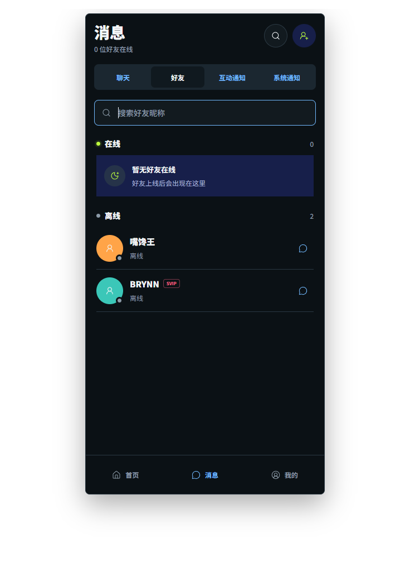

# 消息中心好友列表产品设计方案 V1

> 日期：2026-08-05<br>
> 适用端：Expo 移动端与 Web 移动布局<br>
> 交付原则：本方案全部能力一次性交付，不拆分阶段；生产界面只展示真实接口数据，不内置演示账号、假状态、Mock 回退或随机数据。

## 1. 产品结论

在消息中心现有“聊天 / 互动通知 / 系统通知”分段导航中新增同级“好友”页签，形成“聊天 / 好友 / 互动通知 / 系统通知”四个入口。好友页承担完整好友查找与在线状态浏览，聊天页继续承担最近会话，顶部搜索按钮切换到好友页并聚焦搜索框，添加好友按钮继续进入现有添加好友流程。

该方案不新建孤立页面，也不把好友塞入最近消息面板。这样既保留现有消息中心的使用习惯，又让所有好友，包括没有最近消息的好友，都有稳定可发现的入口。

## 2. 目标与成功标准

### 2.1 用户目标

1. 用户进入消息中心后，能在一次点击内看到全部真实好友。
2. 用户能明确区分在线、离线和状态暂不可确认三种情况。
3. 用户能通过昵称或用户名快速找到好友，并直接进入已有单聊。
4. 好友上线、下线后，列表和顶部在线人数实时同步，不需要手动刷新。
5. 网络中断、重新连接、空列表和接口失败时，界面不把未知状态误报为离线。

### 2.2 验收指标

- 首次进入好友页时，已登录且网络正常条件下 2 秒内出现首屏真实列表或明确加载态。
- `presence.changed` 到达后 1 秒内更新对应好友分组、状态点和在线总数。
- 多设备登录时，只要好友任一设备仍有有效 WebSocket 连接，就保持在线；最后一个连接断开才转为离线。
- 搜索结果与当前真实好友集合一致，不返回非好友，不产生本地示例项。
- 从好友行进入的会话，必须与该好友的真实 `conversationId` 对应。
- 320px 及以上宽度不出现页签、昵称、身份标识、状态或底部导航重叠。

## 3. 信息架构

```text
消息
├── 聊天：在线摘要、最近消息、未读数
├── 好友：好友搜索、在线分组、离线分组、发消息
├── 互动通知：动态与博客互动
└── 系统通知：反馈处理结果

右上角操作
├── 搜索：切换到“好友”并聚焦好友搜索
└── 添加好友：进入现有 /social/add-friend
```

底部“消息”导航保持选中，其他全局导航不变。好友申请继续由现有添加好友页处理，避免同一任务出现两个入口和两套状态。

## 4. 好友页设计



### 4.1 页面结构

1. 顶部标题继续显示“消息”；副标题显示 `N 位好友在线`，N 从完整好友数据实时计算，不能使用只取前 5 位后的数组长度。
2. 四段页签沿用现有深色分段控件，当前页签使用更深底色和白字，其他页签使用现有蓝色文字。
3. 搜索框固定在好友页内容顶部，支持昵称 `displayName` 与账号 `username` 的包含匹配，忽略英文大小写和首尾空格。
4. 列表使用“在线”和“离线”两个分组。分组标题右侧显示真实数量；在线始终排在离线之前。
5. 好友行展示真实头像、昵称、公开身份标识、状态文案与消息图标。整行和消息图标均进入同一真实单聊，不新增无效详情页。

### 4.2 排序规则

- 在线组按 `displayName` 排序；同名时按 `username` 排序，保证重进页面顺序稳定。
- 离线组采用相同排序规则，不显示后端尚未存储的“最近上线时间”。
- 收到 `presence.changed` 后，好友跨组移动；列表使用稳定 `user.id` 作为 key，避免头像与昵称错位。
- 搜索状态下仍保留分组结构，只显示命中好友并重算当前可见数量。

### 4.3 交互规则

- 点击“好友”页签：保留本次会话内搜索词；离开消息中心后再次进入默认回到“聊天”。
- 点击顶部搜索：切换到“好友”页签并唤起键盘；不得再跳转到添加好友页。
- 点击清除：清空搜索词、恢复完整列表并保持输入框焦点。
- 点击好友行：从 `conversations` 中按 `peer.id` 查找真实会话并进入 `/social/chat/[conversationId]`。
- 会话数据暂未同步到但好友真实存在时：先触发一次 `refresh()`；仍无会话则显示“会话暂时无法打开，请稍后重试”，不得生成临时会话 ID。
- 点击添加好友：继续进入现有添加好友页；好友申请被接受后，实时事件刷新好友列表和会话列表。

## 5. 完整状态设计

| 状态 | 页面表现 | 可执行动作 |
| --- | --- | --- |
| 首次加载 | 搜索框下显示骨架行，不显示示例好友和 0 在线结论 | 等待、返回 |
| 有在线好友 | 在线组显示真实好友，绿色状态点；离线组显示其余好友 | 搜索、发消息、切换页签 |
| 0 位在线 | 在线组显示“暂无好友在线”，离线组照常展示 | 搜索、发消息 |
| 0 位好友 | 显示“还没有好友”和“添加好友”按钮 | 进入添加好友 |
| 搜索无结果 | 显示“没有匹配的好友”，不推荐虚构账号 | 清除搜索 |
| WebSocket 重连 | 顶部显示“在线状态同步中”；所有状态标为“同步中”，不把未知当离线 | 继续浏览、自动重连 |
| 列表接口失败且无缓存 | 显示“好友列表暂时无法同步”和重试按钮 | 重试 |
| 列表接口失败但有本次会话数据 | 保留列表并标注“数据可能已更新，点击重试”；在线状态改为“同步中” | 重试、查看已有会话 |
| 登录失效 | 沿用消息中心未登录态 | 登录 / 注册 |

空状态与异常态全部是界面状态，不包含伪造用户数据。生产构建不得在接口失败时导入 `frontend/mocks` 或展示设计稿中的静态账号。

## 6. 真实数据方案

### 6.1 权威数据源

| 页面字段 | 权威来源 | 更新方式 |
| --- | --- | --- |
| 好友关系、昵称、账号、头像、角色 | `GET /api/v1/friends`，来自 `friendships` 与 `users` | 首次加载、页面刷新、关系事件后刷新 |
| 当前在线状态 | 响应中的 `user.online`，由 `realtimeHub.IsOnline(userId)` 计算 | 初始快照 + `presence.changed` |
| 在线总数 | 前端对完整 `friends` 集合过滤计算 | 每次好友或状态更新后派生 |
| 单聊入口 | `GET /api/v1/conversations` 中 `peer.id -> id` 映射 | 首次加载、消息或好友事件后刷新 |
| 身份标识 | `user.role` | 跟随好友接口刷新 |

本需求不需要新增假数据层，也不要求新增持久化表。现有好友关系、会话和实时 Hub 已能提供核心数据。

### 6.2 在线判定

- 在线：该用户在实时 Hub 中至少存在一个有效 WebSocket 客户端。
- 离线：该用户在实时 Hub 中没有有效客户端，且当前客户端已取得权威快照或保持实时连接。
- 同步中：当前客户端与实时服务断开，无法保证状态新鲜度。
- 多端规则：首个连接建立时才广播上线；最后一个连接断开时才广播下线，现有 Hub 已按此规则实现。
- 服务端每 30 秒 Ping，连接 70 秒无 Pong 会被移除；不得用客户端本地计时自行伪造上下线。

当前系统没有“最近上线时间”字段，因此本版不展示“几分钟前在线”。如未来产品需要该字段，必须先增加服务端真实记录；不得由客户端猜测。

### 6.3 实时事件处理

`presence.changed` 的数据结构保持现有 `{ userId, online }`。前端收到事件后应只更新匹配好友的 `user.online`，立即重算分组与总数；好友申请、消息等其他事件仍走现有刷新流程。WebSocket 重新连接成功后必须重新拉取 `GET /api/v1/friends`，用服务端快照纠正断线期间遗漏的事件。

为了避免事件风暴，`presence.changed` 不应触发现有的三接口全量刷新；它是可直接合并的权威增量事件。`friend.accepted`、`friend.rejected` 和 `friend.requested` 继续刷新好友、申请与会话数据。

## 7. 前端实现约束

- `MessagesScreen` 的 `activeTab` 扩展为 `'chat' | 'friends' | 'notifications' | 'system'`。
- 新增好友页内容组件，长列表使用 `SectionList` 或等价虚拟化列表，不能用大量普通 `View` 堆叠。
- 新增纯函数负责搜索、分组、排序和在线数计算，覆盖大小写、中文、空查询与状态变化测试。
- `onlineCount` 必须从全部好友计算；聊天页最多展示 5 位在线好友时，只对展示数组切片。
- `SocialProvider` 增加对 `presence.changed` 的定向状态合并；重连后仍以 REST 快照校正。
- 列表只消费 `useSocial().friends` 与 `conversations`，不得引用 `frontend/mocks/app-data.ts`、硬编码好友数组或随机在线值。
- 头像为空时沿用 `SocialAvatar` 的真实降级样式；不得使用虚构头像 URL。

## 8. 视觉规范

- 延续当前页面的近黑背景、深灰内容面、深蓝在线区域、荧光绿在线点、亮蓝交互色和珊瑚红装饰角。
- 页签高度、圆角、标题字号、头像尺寸、分隔线和底部导航均复用 `MessagesScreen` 现有样式常量与主题色。
- 好友状态不能只依赖颜色：绿色点必须配“在线”，灰点必须配“离线”，断线时配“同步中”。
- 好友行点击热区不小于 44px；图标按钮提供 `accessibilityLabel`；昵称可截断但身份标识不能覆盖消息按钮。
- 搜索键盘的提交键设为搜索；列表为空时键盘仍可关闭，页面不产生横向滚动。

## 9. 数据与权限安全

- 仅登录用户可访问好友列表；服务端只返回当前账号已建立的双向好友关系。
- 在线状态只通过好友接口和仅向好友发布的实时事件暴露，不能通过全局用户搜索批量查询在线状态。
- 客户端不得信任路由参数中的用户 ID 直接打开会话，必须使用当前账号有权访问的真实 `conversationId`。
- 日志只记录请求结果与事件类型，不记录聊天正文、访问令牌或完整好友列表。
- 好友解除、账号禁用或登录失效后，下一次快照必须移除相应列表项；旧缓存不可继续作为可交互数据。

## 10. 埋点与质量验收

建议记录 `message_tab_view`、`friend_search`、`friend_chat_open`、`presence_sync_error` 四类事件，参数只包含页签、结果数量、是否命中和错误码，不上传搜索原文或好友昵称。

上线前必须完成以下验证：真实账号 0/1/20+ 好友、0/多位在线、多设备在线、上线下线跨组、搜索命中与无结果、好友申请接受后出现、WebSocket 断开重连、接口 401/500、会话缺失保护、320/360/430px 布局、读屏标签与键盘操作。测试数据只允许在自动化测试环境通过工厂创建，生产包和生产接口不得携带测试账号或 Mock 回退。

## 11. 设计稿数据说明

设计稿中的“0 位好友在线”、`嘴馋王`、`BRYNN`、日期和消息内容均来自用户提供的现有页面截图；未补造在线用户、最近上线时间、头像图片或聊天内容。生产实现渲染时，这些静态示意值必须全部替换为上述真实接口数据。
